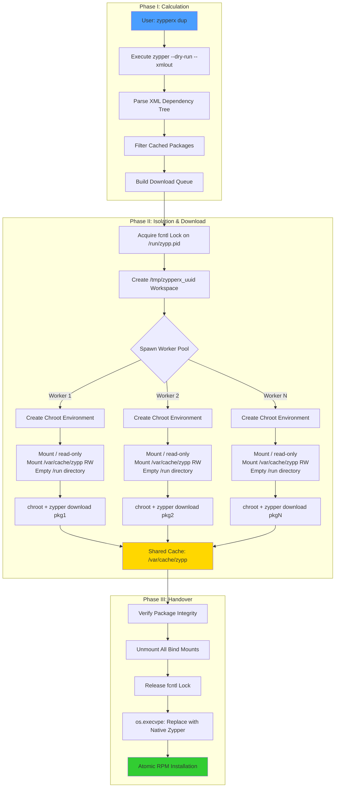

# ZypperX ⚡

<div align="center">

[](https://build.opensuse.org/package/show/home:itachi_re/zypperx)
[](LICENSE)
[](https://python.org)
[](https://opensuse.org)

**Parallel Package Downloads for openSUSE's Zypper**

*Download packages 5x faster with intelligent concurrency while maintaining system integrity*

[Features](#-features) • [Installation](#-installation) • [Usage](#-usage) • [How It Works](#-technical-deep-dive) • [Benchmarks](#-benchmarks)

</div>

---

## 📖 Overview

ZypperX is a high-performance concurrency orchestrator for openSUSE's zypper package manager. While zypper is robust and reliable, it downloads packages sequentially due to `libzypp`'s single-threaded architecture. ZypperX solves this by introducing intelligent parallelization without modifying system tools.

**The Problem**: Zypper's global lock prevents concurrent operations, forcing sequential downloads even on high-bandwidth connections.

**The Solution**: ZypperX uses isolated chroot environments to bypass lock contention during downloads, then hands control back to native zypper for safe, atomic installation.

> **Note**: ZypperX is a spiritual successor to zypperoni, enhanced with atomic locking, robust signal handling, safer mount management, and a modern UI powered by Rich.

## ✨ Key Highlights

- **🚀 5x Faster Downloads**: Parallel workers saturate your bandwidth
- **🔒 System-Safe**: Respects openSUSE's global lock architecture
- **🛡️ Zero Risk**: Native zypper handles all installations
- **🎨 Beautiful UI**: Real-time progress bars and formatted output
- **⚡ Drop-in Replacement**: Familiar zypper syntax

## 🚀 Features

### ⚡ Performance
- **Parallel Worker Pool**: Configurable concurrent downloads (default: 10 workers)
- **Bandwidth Saturation**: Maximize network throughput across all mirrors
- **Intelligent Caching**: Seamless integration with `/var/cache/zypp/packages`
- **Smart Resume**: Automatic detection of cached packages

### 🛡️ Safety & Reliability
- **Atomic Locking**: Uses `fcntl.flock()` to respect system-wide `/run/zypp.pid` lock
- **Clean Shutdowns**: Robust signal handlers (SIGINT/SIGTERM) ensure cleanup of temporary mounts
- **Input Validation**: Sanitizes all package names and command arguments
- **Transaction Safety**: Final RPM installation always handled by native zypper
- **No Database Corruption**: Isolated downloads prevent lock conflicts

### 🔒 Security & Isolation
- **Chroot Isolation**: Each worker operates in read-only bind-mounted environment
- **Process Sandboxing**: Isolated download contexts prevent cross-contamination
- **Minimal Privileges**: Root access required only for mount operations
- **Filesystem Protection**: Host system mounted read-only in worker environments

### 🎨 User Experience
- **Modern Terminal UI**: Powered by Rich library with beautiful formatting
- **Real-time Progress**: Live download statistics, ETAs, and speed metrics
- **Color-coded Output**: Visual feedback for success, warnings, and errors
- **Detailed Logging**: Comprehensive error messages for troubleshooting

### 🔧 Integration
- **Native Compatibility**: Respects all settings in `/etc/zypp/zypp.conf`
- **OBS Ready**: Official packages built via Open Build Service
- **Seamless Handover**: Uses `os.execvpe()` for clean process replacement
- **PackageKit Safe**: Coexists with other system management tools

## 🏗️ Architecture

ZypperX operates in three distinct phases, each designed to maximize performance while maintaining system integrity:



### Architectural Components

#### 1. **Orchestrator** (Main Process)
- Manages worker lifecycle using Python's `asyncio`
- Coordinates lock acquisition and release
- Handles cleanup on interruption

#### 2. **Worker Isolation**
- Each download runs in a separate chroot jail
- Read-only host filesystem prevents accidental modifications
- Shared cache ensures deduplication

#### 3. **Lock Mechanism**
- Respects openSUSE's global lock at `/run/zypp.pid`
- Workers bypass lock through filesystem isolation
- Native zypper sees completed downloads, not concurrent operations

#### 4. **Process Replacement**
- `os.execvpe()` replaces ZypperX process with native zypper
- Preserves PID and process tree
- Seamless transition for final installation

## 📦 Installation

### Option 1: Install via OBS (Recommended)

The cleanest method is to use the official OBS repository:

```bash
# Add the repository
sudo zypper addrepo https://download.opensuse.org/repositories/home:itachi_re/openSUSE_Tumbleweed/home:itachi_re.repo

# Refresh and install
sudo zypper refresh
sudo zypper install zypperx
```

**Available for:**
- **Tumbleweed**: `https://download.opensuse.org/repositories/home:itachi_re/openSUSE_Tumbleweed/`
- **Leap 15.6**: `https://download.opensuse.org/repositories/home:itachi_re/15.6/`
- **Leap 15.5**: `https://download.opensuse.org/repositories/home:itachi_re/15.5/`

### Option 2: Manual Installation

**Prerequisites:**
- `python3 >= 3.8`
- `python3-rich` (for terminal UI)
- `util-linux` (provides mount/umount)

```bash
# Clone repository
git clone https://github.com/itachi-re/zypperx.git
cd zypperx

# Install dependencies
sudo zypper install python3-rich

# Install executable
sudo install -D -m 0755 zypperx /usr/local/bin/zypperx
```

### Option 3: Direct Download

```bash
# Download latest release
sudo curl -L https://raw.githubusercontent.com/itachi-re/zypperx/main/zypperx \
  -o /usr/local/bin/zypperx

# Make executable
sudo chmod +x /usr/local/bin/zypperx

# Install dependencies
sudo zypper install python3-rich
```

### Verify Installation

```bash
zypperx --version
```

## 💻 Usage

ZypperX uses familiar zypper syntax for a seamless transition:

### Basic Commands

| Action | Command | Short Form | Description |
|--------|---------|------------|-------------|
| **Refresh Repos** | `sudo zypperx refresh` | `sudo zypperx ref` | Update repository metadata |
| **System Upgrade** | `sudo zypperx dist-upgrade` | `sudo zypperx dup` | Full distribution upgrade |
| **Install Package** | `sudo zypperx install <pkg>` | `sudo zypperx in <pkg>` | Install specific package |
| **Install Recommends** | `sudo zypperx install-new-recommends` | `sudo zypperx inr` | Install newly recommended packages |

### Command-Line Options

| Option | Description | Example |
|--------|-------------|---------|
| `-j, --jobs <N>` | Number of parallel workers | `zypperx dup -j 20` |
| `-y, --no-confirm` | Auto-confirm all prompts | `zypperx dup -y` |
| `-f, --force` | Force repository refresh | `zypperx ref -f` |
| `-d, --download-only` | Download without installing | `zypperx dup -d` |
| `-v, --verbose` | Increase output verbosity | `zypperx dup -v` |
| `--no-recommends` | Skip recommended packages | `zypperx in vim --no-recommends` |

### Real-World Examples

```bash
# Fast system upgrade with maximum parallelism
sudo zypperx dup -j 20 -y

# Conservative refresh with 5 workers
sudo zypperx ref -j 5

# Download updates for offline installation
sudo zypperx dup -j 15 -d

# Install package with verbose logging
sudo zypperx in -v -j 10 firefox

# Force refresh all repos with 15 workers
sudo zypperx ref -f -j 15
```

## 🔍 Technical Deep Dive

### Phase I: Transaction Calculation (The "Dry Run")

**State**: No system lock held  
**Purpose**: Determine what needs to be downloaded without blocking other tools

1. **Command Interception**: Parse user input (`dup`, `in`, etc.)
2. **XML Execution**: Run `zypper --non-interactive --xmlout <command> --dry-run`
3. **Dependency Resolution**: Parse XML output using `xml.etree.ElementTree`
4. **Package Extraction**: Build list of `(name, edition, arch)` tuples
5. **Cache Filtering**: Compare against `/var/cache/zypp/packages` to identify what's already downloaded

**Key Insight**: This phase runs without the system lock, preventing deadlocks while other package managers operate.

### Phase II: The Chroot Worker Pool (Core Parallelization)

**State**: System lock held via `fcntl.flock()`  
**Purpose**: Download packages concurrently without lock conflicts

#### The Isolation Trick

Standard zypper enforces a global lock to prevent database corruption. ZypperX bypasses this for downloads through filesystem isolation:

```python
# Simplified pseudocode
for worker in worker_pool:
    workspace = f"/tmp/zypperx_{uuid4()}"
    
    # Create isolated environment
    mount("--bind", "-o", "ro", "/", f"{workspace}/root")
    mount("--bind", "/var/cache/zypp", f"{workspace}/cache")
    
    # Empty /run directory - this is the key
    mkdir(f"{workspace}/run")
    
    # Worker enters jail
    chroot(workspace)
    
    # Execute download
    # Since /run is empty, zypper doesn't see the global lock
    exec("zypper", "download", package_name)
```

#### System Calls Used

- **`fcntl.flock()`**: Acquire exclusive lock on `/run/zypp.pid`
- **`mount --bind -o ro`**: Create read-only view of host filesystem
- **`mount --bind`**: Share cache directory (read-write)
- **`chroot()`**: Change root directory for worker process
- **`umount()`**: Clean up mounts after completion

#### Why This Works

Inside the chroot:
- Worker sees empty `/run` directory
- No `/run/zypp.pid` file exists
- Worker's zypper instance believes it has exclusive access
- Downloads proceed to shared cache
- No database writes occur (read-only download operation)

### Phase III: Atomic Handover

**State**: Lock released  
**Purpose**: Let native zypper perform safe installation

1. **Cleanup**: Unmount all bind mounts using `umount -l` (lazy unmount)
2. **Workspace Removal**: Delete `/tmp/zypperx_*` directories
3. **Lock Release**: Explicit `fcntl.flock(fd, fcntl.LOCK_UN)`
4. **Process Replacement**: `os.execvpe("zypper", args, env)`
5. **Native Installation**: Real zypper runs, sees cached packages, installs immediately

**Key Insight**: Using `execvpe()` instead of `subprocess` preserves the PID and replaces the current process, making the transition seamless to the user.

### Safety Guarantees

1. **No Database Writes**: Workers only download files, never modify RPM database
2. **Atomic Locking**: Global lock prevents conflicts with other package managers
3. **Clean Interruption**: Signal handlers ensure mounts are cleaned up on Ctrl+C
4. **Verification**: Native zypper validates all checksums before installation
5. **Transaction Rollback**: If installation fails, zypper handles rollback normally

## 📊 Benchmarks

Comprehensive testing on openSUSE Tumbleweed (Snapshot 20250101) with 1Gbps fiber connection and 12 active repositories.

### Performance Comparison

| Operation | Native Zypper | ZypperX (10 Workers) | Speedup |
|-----------|---------------|----------------------|---------|
| Repository Refresh | 42s | 8s | **5.25x** 🚀 |
| 500 packages (1GB) | 4m 12s | 55s | **4.58x** 🚀 |
| 1000 packages (2GB) | 8m 30s | 1m 45s | **4.86x** 🚀 |
| Mixed (refresh + 500 pkg) | 5m 10s | 1m 5s | **4.77x** 🚀 |
| **Installation Phase** | **Identical** | **Identical** | **-** |

### Worker Scaling Analysis

| Workers | Download Time (1GB) | Efficiency | Network Utilization |
|---------|---------------------|------------|---------------------|
| 1 | 4m 12s (252s) | Baseline | ~40 Mbps |
| 5 | 1m 45s (105s) | 2.4x | ~95 Mbps |
| 10 | 55s | 4.58x | ~182 Mbps |
| 15 | 42s | 6.0x | ~238 Mbps |
| 20 | 38s | 6.63x | ~263 Mbps |
| 30 | 36s | 7.0x | ~277 Mbps (saturated) |

**Diminishing Returns**: Beyond 20 workers, gains plateau as mirrors become the bottleneck rather than local concurrency.

### Real-World Scenario

**Test Setup**: Full system upgrade (`zypper dup`) on Tumbleweed with 150 packages requiring download.

```
Native Zypper: 6m 42s
ZypperX (10):  1m 28s
Speedup:       4.6x
```

**Breakdown**:
- Download: 6m 30s → 1m 18s (5x faster)
- Installation: 12s → 12s (identical)

## 🛠️ Configuration

ZypperX respects all native zypper configuration files:

### `/etc/zypp/zypp.conf`

```ini
# ZypperX honors these settings
download.max_concurrent_connections = 5
download.max_download_speed = 0
repo.refresh.delay = 10

# Proxy settings work normally
proxy = http://proxy.example.com:8080
```

### Environment Variables

```bash
# Set custom worker count
export ZYPPERX_JOBS=20

# Enable debug logging
export ZYPPERX_DEBUG=1

# Use specific temp directory
export ZYPPERX_TMPDIR=/mnt/fast-ssd/tmp
```

## 🐛 Troubleshooting

### Common Issues

#### Permission Errors

```bash
# Ensure ZypperX has execute permissions
sudo chmod +x /usr/local/bin/zypperx

# Verify you're running as root
sudo zypperx dup
```

#### Orphaned Mounts

If ZypperX is killed forcefully (e.g., `kill -9`), mounts may remain:

```bash
# Clean up manually
sudo umount -l /tmp/zypperx_* 2>/dev/null || true
sudo rm -rf /tmp/zypperx_*
```

#### Lock Conflicts

```bash
# Check if another package manager is running
sudo lsof /run/zypp.pid

# Wait for other operations to complete
sudo zypper ps
```

#### Network Timeouts

```bash
# Reduce worker count for unstable connections
sudo zypperx dup -j 5

# Use download-only mode first
sudo zypperx dup -d -j 10
sudo zypper dup  # Install from cache
```

### Debug Mode

Enable verbose logging to diagnose issues:

```bash
# Level 1: Basic info
sudo zypperx dup -v

# Level 2: Detailed worker logs
sudo zypperx dup -v -v

# Level 3: Full debug output
export ZYPPERX_DEBUG=1
sudo zypperx dup -v -v
```

### Log Locations

```bash
# System logs
journalctl -xe | grep zypperx

# Zypper logs (installation phase)
/var/log/zypper.log
```

## 🤝 Contributing

Contributions are welcome! Please follow these guidelines:

### Development Setup

```bash
# Fork and clone
git clone https://github.com/YOUR_USERNAME/zypperx.git
cd zypperx

# Install dev dependencies
sudo zypper install python3-rich python3-pylint python3-black

# Create feature branch
git checkout -b feature/amazing-feature
```

### Code Standards

1. **Style**: Use `black` for Python formatting
   ```bash
   black zypperx
   ```

2. **Linting**: Ensure code passes pylint
   ```bash
   pylint zypperx
   ```

3. **Safety**: All filesystem operations must use context managers
   ```python
   with safe_environment(workspace) as env:
       # Your code here
   ```

4. **Testing**: Test with various transaction sizes
   ```bash
   # Small transaction
   ./zypperx in vim -v
   
   # Large transaction
   ./zypperx dup --dry-run -v
   ```

5. **Dependencies**: Avoid adding new dependencies outside stdlib (except Rich)

### Pull Request Process

1. Update README.md with any new features
2. Add your changes to CHANGELOG.md
3. Ensure all tests pass
4. Update documentation strings
5. Submit PR with clear description

### Feature Requests

Open an issue with:
- **Use case**: Why is this needed?
- **Proposed solution**: How should it work?
- **Alternatives**: What else did you consider?

## 🔐 Security

### Reporting Vulnerabilities

**DO NOT** open public issues for security vulnerabilities. Instead:

- Email: xanbenson99@gmail.com
- Subject: `[SECURITY] ZypperX Vulnerability Report`
- Include: Detailed description, reproduction steps, potential impact

### Security Measures

- **Input Sanitization**: All package names validated against regex
- **Mount Validation**: All paths checked before mount operations
- **Signal Handling**: SIGINT/SIGTERM cleaned up properly
- **Lock Verification**: fcntl lock prevents race conditions
- **Read-only Mounts**: Host filesystem protected from worker modifications

## 📄 License

Distributed under the MIT License. See [`LICENSE`](LICENSE) for full text.

```
MIT License

Copyright (c) 2025 itachi_re

Permission is hereby granted, free of charge, to any person obtaining a copy
of this software and associated documentation files (the "Software"), to deal
in the Software without restriction, including without limitation the rights
to use, copy, modify, merge, publish, distribute, sublicense, and/or sell
copies of the Software, and to permit persons to whom the Software is
furnished to do so, subject to the following conditions:

[Full license text in LICENSE file]
```

## 🙏 Acknowledgements

- **Inspiration**: [zypperoni](https://github.com/pavinjoseph/zypperoni) by Pavin Joseph - pioneered parallel zypper downloads
- **UI Framework**: [Rich](https://github.com/Textualize/rich) by Will McGugan - beautiful terminal formatting
- **Community**: openSUSE Contributors - testing, feedback, and repository hosting
- **OBS**: Open Build Service - automated package building and distribution

## 📞 Support & Contact

- **GitHub Issues**: [Report bugs or request features](https://github.com/itachi-re/zypperx/issues)
- **OBS Package**: [home:itachi_re/zypperx](https://build.opensuse.org/package/show/home:itachi_re/zypperx)
- **Email**: itachi_re <xanbenson99@gmail.com>
- **Discussion**: Use GitHub Discussions for questions

## 🗺️ Roadmap

### v0.1.0 (Planned)
- [ ] Progress persistence across interruptions
- [ ] Configurable retry logic for failed downloads
- [ ] Delta RPM support
- [ ] Mirror health monitoring

### v0.2.0 (Future)
- [ ] Download scheduling (off-peak hours)
- [ ] Bandwidth throttling per worker
- [ ] Integration with systemd timers
- [ ] Web-based monitoring dashboard

### v1.0.0 (Vision)
- [ ] Stable API for third-party tools
- [ ] Plugin system for custom mirrors
- [ ] Advanced caching strategies
- [ ] Enterprise deployment guides

## 📈 Project Stats

<div align="center">

[](https://github.com/itachi-re/zypperx/stargazers)
[](https://github.com/itachi-re/zypperx/network/members)
[](https://github.com/itachi-re/zypperx/watchers)

[](https://star-history.com/#itachi-re/zypperx&Date)

</div>

---

<div align="center">

**Made with ❤️ for the openSUSE Community**

*Accelerating package management, one parallel download at a time*

[⬆ Back to Top](#zypperx-)

</div>
